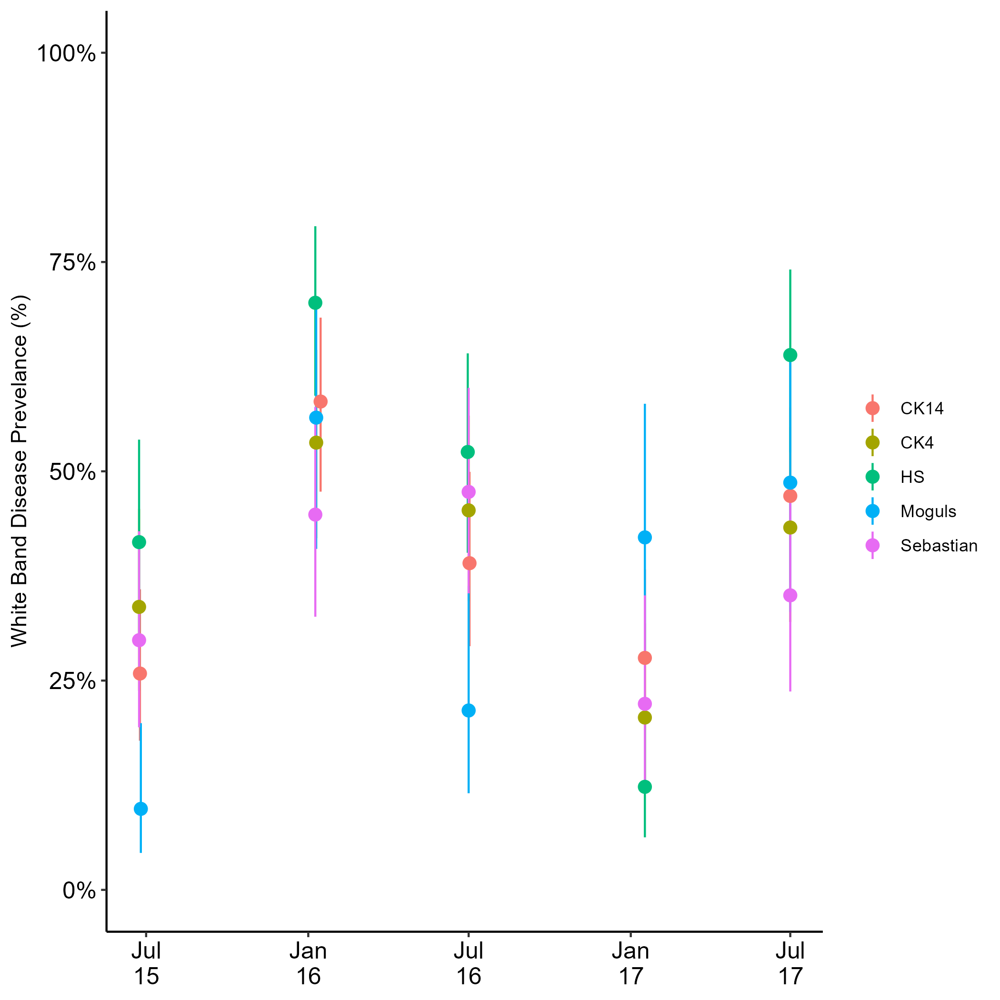

# Panama_Tank_Field
 Analysis of Field survey of White Band Disease coupled with tank experiment (including antibiotic exposure)

# Disease Prevalence Analysis
In Panama White-Band Disease prevalence significantly varies through time (χ2(4) = 105.5, p < 0.000001) and across sites (χ2(4) = 16.4, p = 0.0024) and varies differently across sites through time (χ2(16) = 49.08, p = 0.000032).

Generally, the prevalence of WBD increased by ~1.49x per year (p = 0.015) with a peak in disease prevalence in 2016 (p < 0.00001). Further investigation reveals that Moguls is the site predominantly driving the observation of increasing prevalence over the years with a ~7.7x increase per year (p < 0.0001). All other sites are more consistent across years (p > 0.07) though all sites show a peak in disease prevalence in 2016 (all p < 0.0001). Posthoc contrasts further show no consistent differences between seasons across sites (p = 0.617) though there are significant seasonal differences in HS (1.9x more prevalent in summer, p = 0.013) and Moguls (0.31x more prevalent in summer, p = 0.0003). Given inconsistent signal of seasonality across sites it appears that 2016 generally had higher bleaching in Panama than other years and the putatively observed seasonal pattern is merely variation among sites.

# 
